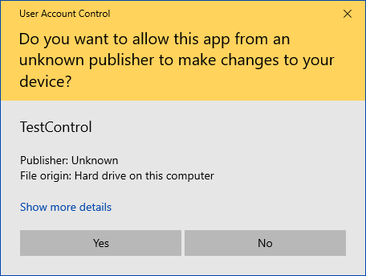
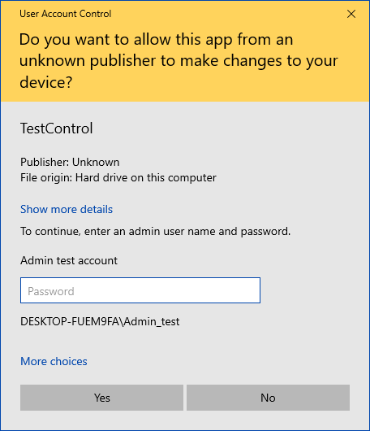
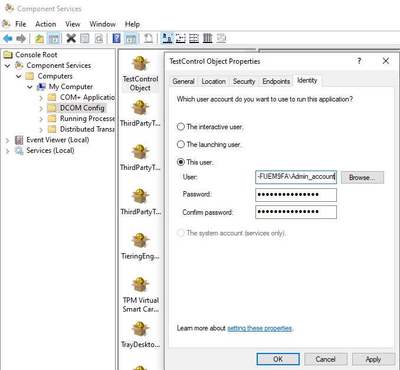

## How to configure COM servers to always run as admin _with_ UAC

Read [COM Elevation Moniker](https://docs.microsoft.com/en-us/windows/win32/com/the-com-elevation-moniker) for instructions for how to use User Account Control (UAC) prompts to request admin privileges for a COM server. UAC is general is documented in [How User Account Control works](https://docs.microsoft.com/en-us/windows/security/identity-protection/user-account-control/how-user-account-control-works) Also need to explicitly call `CoInitializeSecurity` in the COM server to enable low privilege clients to connect.

Instructions:
* Build solution from Visual Studio started with admin privileges.
* To test, run `RunInSandbox.exe hi TestControl.TestControl` from a non-admin command prompt. This will trigger a UAC prompt (if UAC is enabled) before the COM server is started. The UAC prompt will require a password _if_ the current user is not an admin.

   

## How to configure COM servers to always run as admin _without_ UAC

**WARNING**: This will introduce a privilege escalation vulnerability if not used carefully.

`Component Services` (dcomcnfg.exe) can be used to explicitly set the user account used for out-of-proc COM servers. This can be used to make a COM server always run with admin privileges without requiring any UAC prompt. Also need to explicitly call `CoInitializeSecurity` in the COM server to enable low privilege clients to connect.

  

This will modify the [`HKCR\AppID\{APPID}\RunAs`](https://learn.microsoft.com/en-us/windows/win32/com/runas) registry value for the COM server. 

### Instructions to test
* From `dcomcnfg.exe` configure the COM server to always run through an administrative account.
* Verify that the account have sufficient filesystem permissions to run the COM server.
* To test, run `RunInSandbox.exe TestControl.TestControl` from a limited account. This will trigger creation of a TestControl.exe under an admin account with a COM communication channel between the processes.

CoCreateInstance calls from non-admin accounts will now start the COM server using an admin account.
